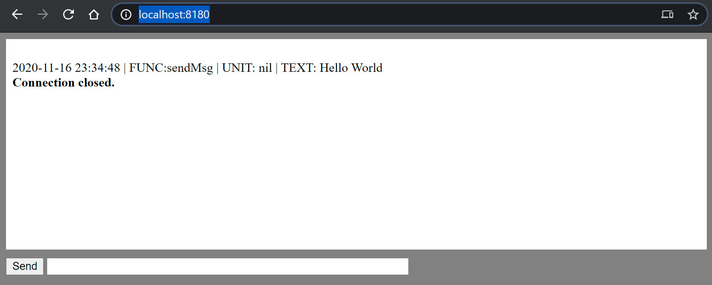

# Websocket logger example

Реализация простого логирования в вебсокеты, консоль и файл

Запустим пример
1. Запустим сервер
```sh
cd ../chat-pokemon
λ  go run .
```
2. Откроем страницу в браузере  
http://localhost:8180/
3. Отправим текст для логера, что бы он транслировал в вэб окно и тд.
```sh
$ curl -H "Content-Type: application/json" -X POST http://localhost:8180/wsx/sendMsg -d "Hello World"
```


